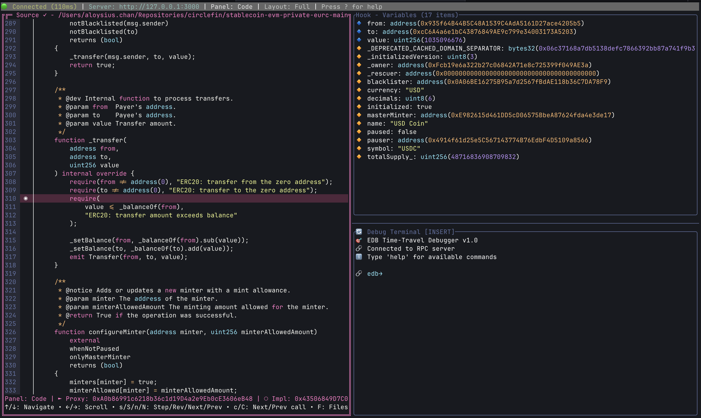

# EDB - Ethereum Debugger 🔍

**Source-level time-travel debugger for Ethereum smart contracts**

EDB bridges the gap between high-level Solidity code and low-level EVM execution, providing the three essential debugging features that have been missing from the Ethereum ecosystem: **step-by-step execution at the source code level**, **local variable value inspection**, and **custom expression evaluation during debug execution**.

> ⚠️ **Note**: EDB is currently under active development. Features and APIs may change as we continue to improve the debugging experience.


## Installation

### Prerequisites

- **Ethereum RPC endpoint** - Public (like Infura/Alchemy) or local node

### Build from Source

```bash
# Clone the repository
git clone https://github.com/edb-rs/edb
cd edb

# Build all components
cargo build --release

# Install binaries
cargo install --path crates/edb
cargo install --path crates/rpc-proxy
cargo install --path crates/tui
```

## Quickstart

### Debug an On-Chain Transaction

Debug any transaction from mainnet or testnets:

```bash
# Debug a transaction with Terminal UI (default)
edb --rpc-urls <RPC_ENDPOINTS> replay 0x5bedd885ff628e935fe47dacb6065c6ac80514a85ec6444578fd1ba092904096
```
The `RPC_ENDPOINTS` should be a comma-separated list of RPC endpoint URLs.
EDB will utilize the RPC endpoints to obtain on-chain states to replay the transaction.
The more RPC endpoints are provided, the faster the replay is.

EDB will by default start a TUI debugger:


Type `?` in the TUI to view the help page.

## Why EDB?

Traditional Ethereum debugging tools operate at the bytecode level, making it nearly impossible to understand what's happening in your Solidity code.

Tools like [Remix IDE's debugger](https://remix-ide.readthedocs.io/en/latest/debugger.html), [Foundry's `forge debug`](https://book.getfoundry.sh/forge/debugger), and [Hardhat's console debugger](https://hardhat.org/hardhat-network/docs/guides/forking-other-networks) show you opcode-by-opcode execution, stack traces, and raw memory dumps.
While powerful, these tools require developers to mentally map between high-level Solidity constructs and low-level EVM operations, which is, however, a complex and error-prone process.

**The fundamental challenge:** While Solidity compilers generate source maps to link bytecode back to source code, this mapping is fragile and often imprecise, especially for optimized contracts.

Existing debuggers rely on these source maps to display which source line corresponds to each opcode, but they still can't reliably reconstruct high-level variable values, function call contexts, or complex data structures from raw EVM state.
The source maps frequently point to wrong lines or become completely unreliable when compiler optimizations are enabled.

**EDB's solution:** Instead of trying to decode bytecode back to source level, we instrument your Solidity contracts at the source code level.
By inserting strategic debugging hooks during compilation, EDB creates contracts that can report their own state in terms of your original high-level constructs.

### What makes EDB different:

- **True source-level debugging** - Step through your actual Solidity code, not disassembled bytecode
- **Reliable variable inspection** - Access any local variable, struct field, or array element with confidence
- **Expression evaluation** - Evaluate arbitrary Solidity expressions against the current execution state
- **Time-travel capabilities** - Navigate backward and forward through execution history

## Key Features

### 🎯 **Source-Level Step Execution**
- Step through Solidity statements line by line
- Navigate function calls and returns naturally
- Jump to specific execution points in your code
- Understand control flow without mental bytecode translation

### 🔍 **Local Variable Inspection**
- Inspect values of local variables and function parameters
- View variables exactly as they appear in your source code
- Track variable changes throughout execution

### ⚡ **Custom Expression Evaluation**
- Evaluate any Solidity expression against the current execution state
- Compute complex queries combining multiple variables
